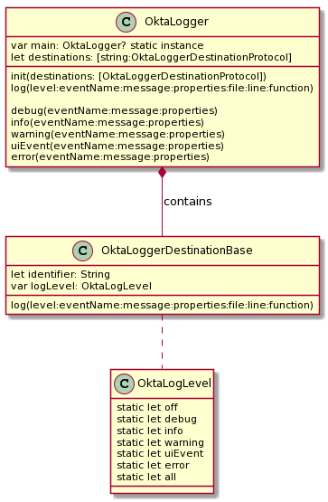
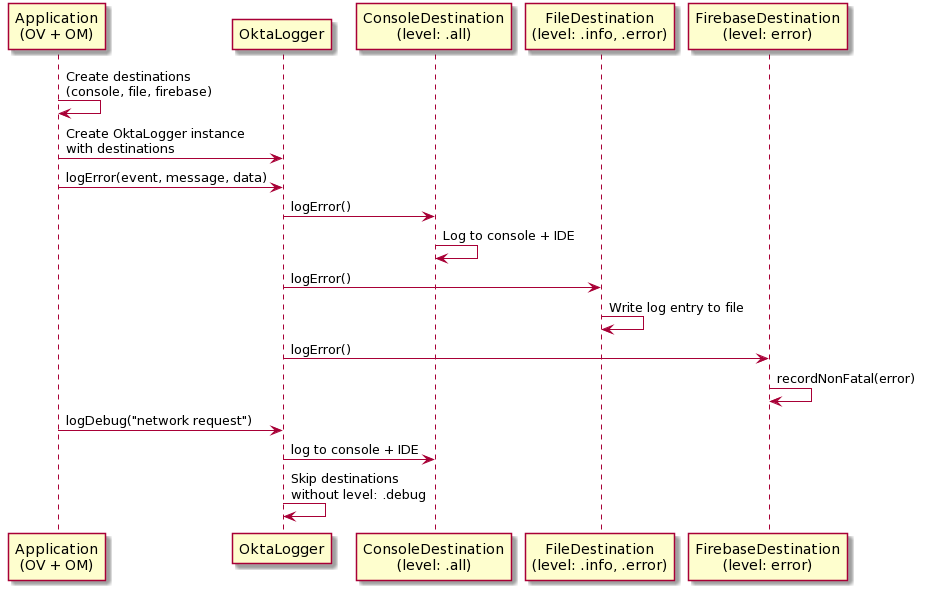

# OktaLogger
OktaLogger is a proxy-based logging SDK for allowing an app to log to many destinations at once, allowing for easy error and metric reporting without extraneous noise.

1. Compatible with Swift and Objective-C
2. Supports single input to multiple output logger classes (e.g. console, firebase, filesystem) 
3. Supports runtime log level changes to any destination
4. Default properties for logging destinations in order to support data such as device identifier.

## Diagrams



## Usage
### Swift
```swift
    // initialization
    let console = OktaLoggerConsoleLogger(identifier: "com.okta.console.logger", level: .all, defaultProperties: nil)
    let firebase = OktaFirebaseDestination(dentifier: "com.okta.firebaselogger", level: .error, defaultProperties: nil)
    OktaLogger.main = OktaLogger(destinations: [console, firebase])
    
    // Logging
    OktaLogger.main.error(eventName: "TOTP Failure", message:"Could not retrieve key for RSA Key: ab43csd")
    
    // Changing log levels
    OktaLogger.main.setLogLevel(level: [.warn, .error], [console.identifier, firebase.identifier])
```
### Objective-C
```objc
    OktaLoggerConsoleLogger *console = [[OktaLoggerConsoleLogger alloc]
                                        initWithIdenitfier:@"com.okta.console.logger" 
                                                     level:OktaLevel.all 
                                        defaultProperties:nil];
    OktaLogger.main = [[OktaLogger alloc] initWithDestinations:@[console]];

    // Objective-c macro defined for convenience
    okl_error(@"TOTP Failure", "Could not retrieve key for RSA Key: %@", key);
```

## Destinations
Logging destinations should inherit from the `OktaLoggerDestinationBase` abstract class (See `OktaLoggerConsoleLogger` ).

Override the `log()` method with

### Pendo
```swift
log(eventName, properties) {
    PendoManager.shared().track(eventName, properties: properties)
}
```
### Firebase
```swift
log(eventName = "share_image", properties = ["name": name as NSObject, "full_text": text as NSObject]) {
    Analytics.logEvent(eventName, parameters: properties)
}
```

## Log Levels and Identifiers
Each destination has an `identifier: String` and an `OktaLoggerLogLevel: NSOptionSet`
Logging destinations will only log events which match against their level(s).

### Example
The following console logger will not log for `debug()` logs, but will for `info()` `warning()` or `error()` logs.
```swift
let consoleLogger = OktaLoggerConsoleLogger(identifier: "console.logger", level: [.info, .warn, .error])`
OktaLogger.main = OktaLogger(destinations: [consoleLogger])
```
The level can be changed at runtime should you wish to begin recording `debug()` level logs
```swift
OktaLogger.main.setLogLevel(level: .all, destinations: [consoleLogger.identifier])
```


